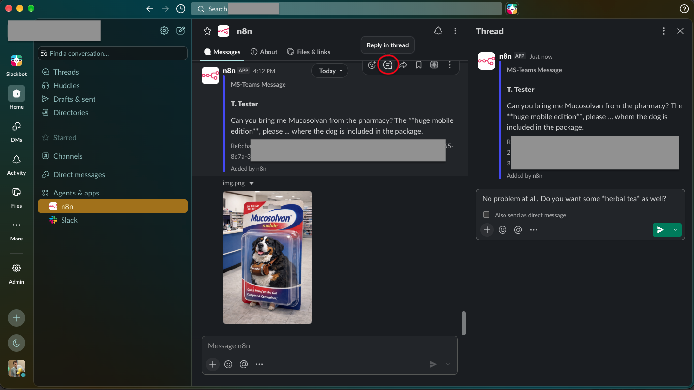
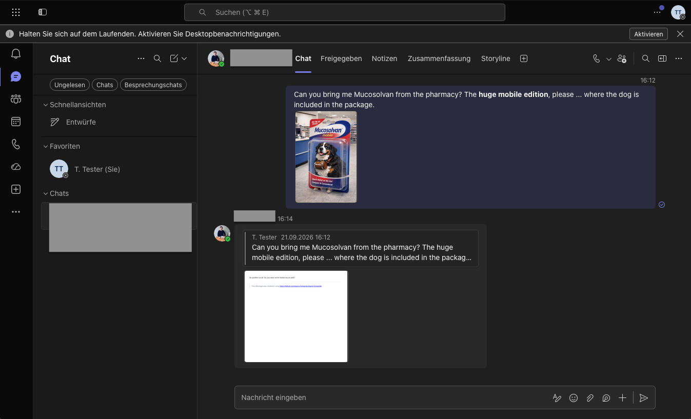
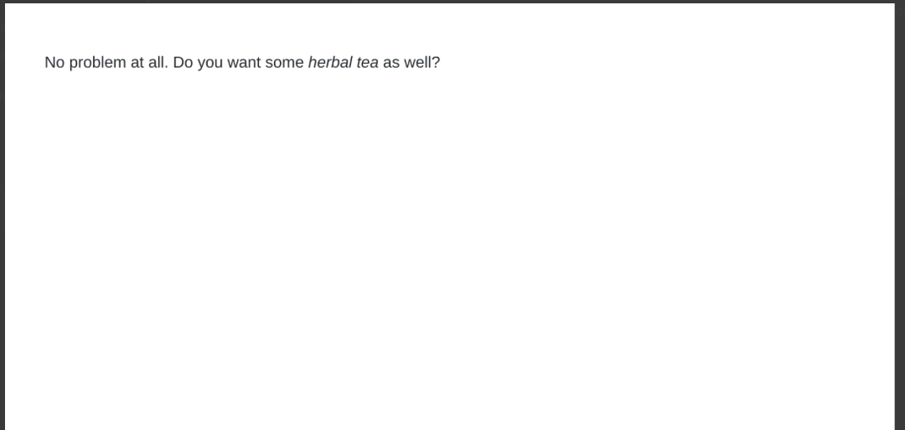

# Teams-Forwarder

This project is a collection of n8n workflows helping MS-Teams users to forward messages to better chat programs.

## Reason

Although MS-Teams is a great tool for IT beginners, it lacks features for professional users and inter-company communication. Missing external tool integrations and no option for multi-tenant users (like agencies) hinder Teams from becoming a suitable tool for all fields. With a great variety about formatting and auto-preview capabilities comes a great insecurity of which part of your copy-paste snippet will become formatting rather than text. This n8n workflow collection is for those who seek an escape to better tools but do want to support MS-Teams-native colleagues with properly formatted Markdown messages.

## How It Works

The n8n trigger node for Incoming MS-Teams messages enables you to forward messages to your favorite chat program. Replies can be sent via the MS-Graph API. Including the original MS-Teams message as a reference closes the loop in the n8n workflow.
Since one of the pain points is formatting, n8n will send a properly formatted image back to the MS-Teams user. This will be generated from your Markdown reply message. A [markdown-2-png converter](./md2png/) is part of this repository.

## Supported Chat Programs

### Mattermost

[Forwarding messages to Mattermost](./mattermost/): responding via slash command.

Images are forwarded from the original MS-Teams message.

Tested with n8n 2.40.0 and Mattermost Team Edition 11.11.0.

### Slack

[Forwarding messages to Slack](./slack/): responding via reply.

Tested with n8n 2.40.0 and Slack Version 4.52.155.

### Discord

(upcoming)
