# Forward MS-Teams Messages To Mattermost

This tutorial shows how to set up two n8n workflows and credentials that forward MS-Teams messages to Mattermost.
When receiving an MS-Teams message in Mattermost, you can reply to the message via the Mattermost slash command.

## Prerequisites

* MS-Azure org admin role (used to create an app registration)
* Mattermost user "n8n"
  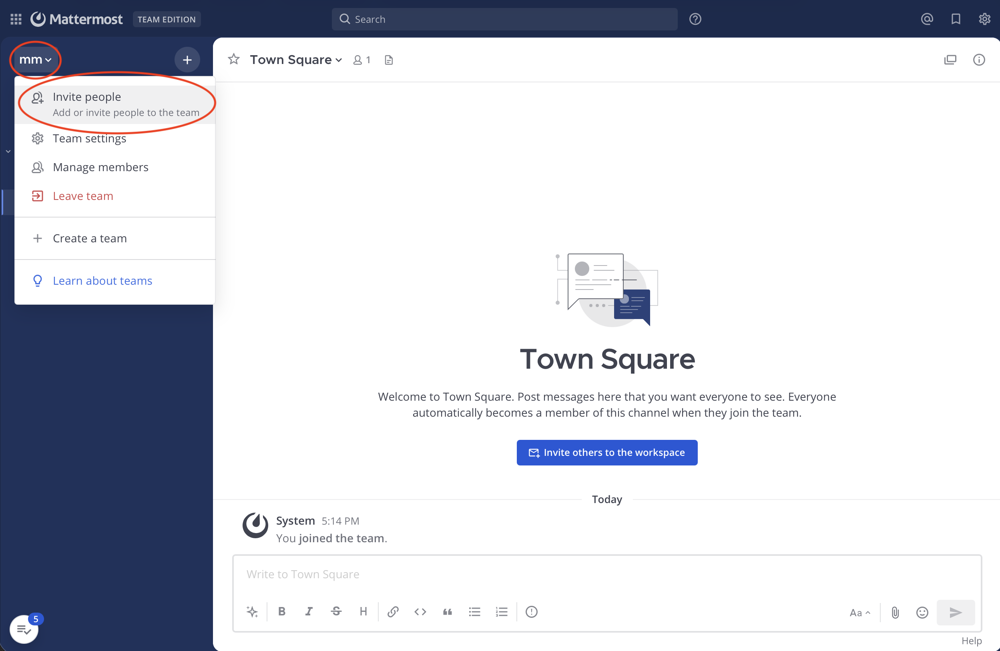
* Mattermost admin role (activate personal access token)
  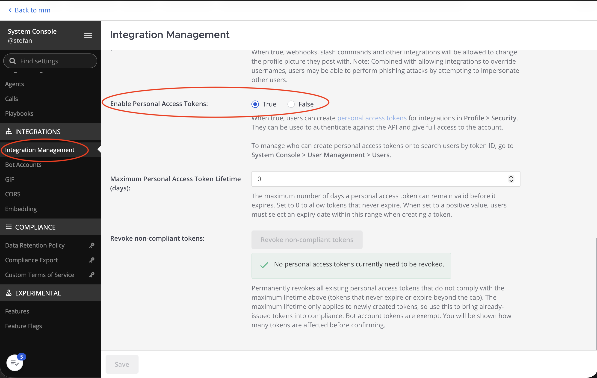
  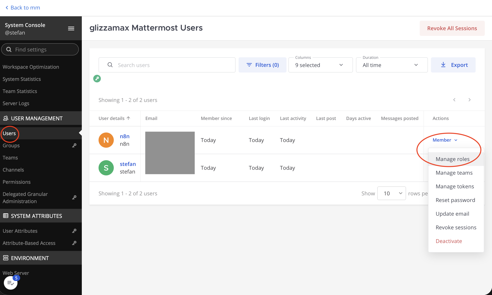
  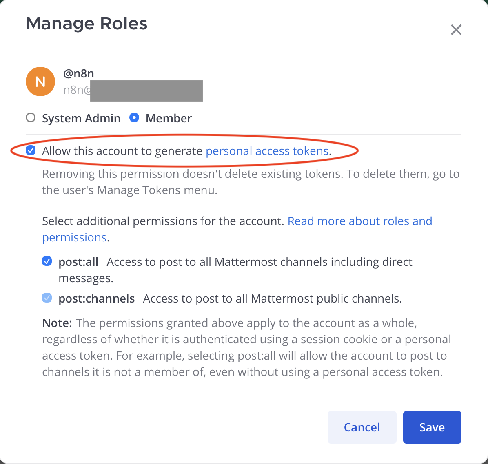
* Mattermost admin role (create Mattermost slash command)
  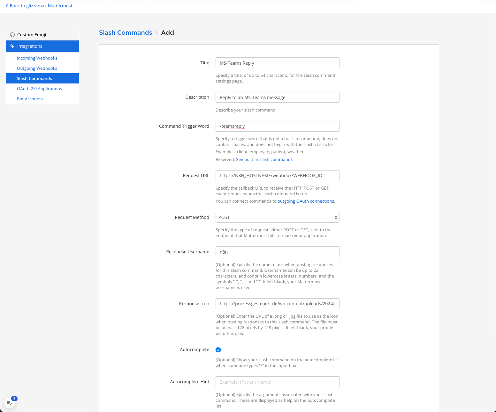
* Somewhere to host a [markdown-2-png converter](../md2png/), this tutorial runs this as an n8n sidecar (Kubernetes) container
* n8n needs to be able to send HTTP(S) requests to Mattermost
* Microsoft's servers need to be able to send HTTP(S) requests to your n8n instance (`/webhook` needs to be public)

## Mattermost Slash Command (1/2)

* Setup a Mattermost slash command `/teamsreply`
  * Start with a URL stub - the correct URL will be filled after the [workflows](#workflow) have been imported
  * Note the slash command token

## Credentials

* Create a personal access token in Mattermost for the "n8n" user
  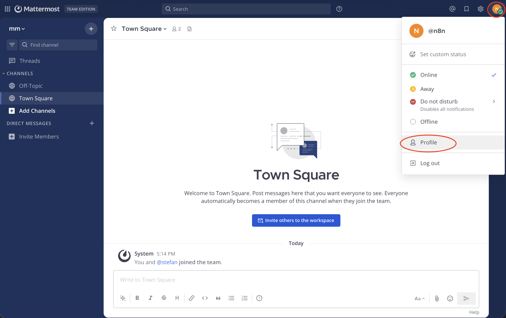
  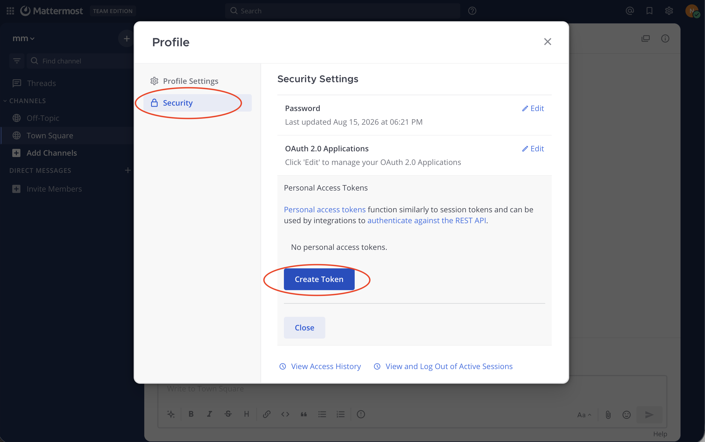
  * Replace `MISSING_MATTERMOST_PA_TOKEN` in [credentials.json](./credentials.json) (twice)
* Relace the `MISSING_WORKFLOW_AUTH_TOKEN` in [credentials.json](./credentials.json) with the slash command token
* Replace `MISSING_MATTERMOST_DOMAIN` with your Mattermost hostname (e.g. `mattermost.example.com`)
* Create [Azure App Registration](https://docs.n8n.io/integrations/builtin/credentials/microsoft)
  * Login and navigate to [Azure App registrations](https://portal.azure.com/#view/Microsoft_AAD_RegisteredApps/ApplicationsListBlade) page
    
  * Create App Registration with "Any Entra ID Tenant + Personal Microsoft accounts" as supported accont types
    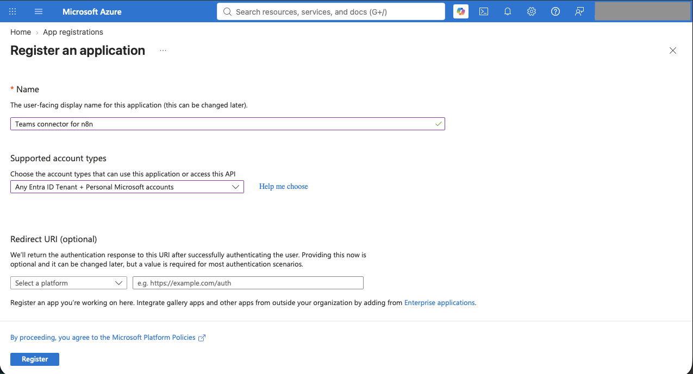
  * Under "API permissions", add the following Microsoft Graph application permissions:
    * `Channel.ReadBasic.All`
    * `ChannelMessage.Read.All`
    * `OnlineMeetings.ReadWrite`
    * `OnlineMeetings.ReadWrite.All`
    * `Team.ReadBasic.All`
    * `User.Read`
  * Let an org admin consent to these permissions for your organization
    
  * Create a client secret under "Certificates and Secrets"
    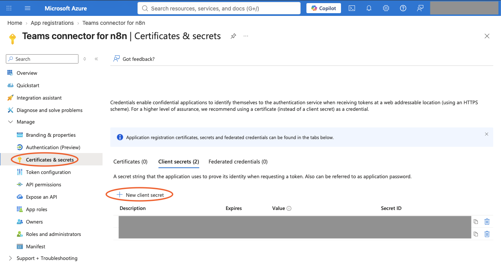
* Import credentials in n8n
  ```bash
  n8n import:credentials --input=credentials.json
  ```
  ... or manually create them in the n8n web-ui
* Modify the "Microsoft Teams OAuth2 API" credential in the n8n web-ui
  * Enter the client ID (Azure App Registration "Application (client) ID")
  * Enter client secret (Azure App Registration client secret)
  * Enable "Custom Scopes": **openid offline_access User.Read.All Group.Read.All Chat.ReadWrite ChannelMessage.Read.All Files.ReadWrite.All ChannelMessage.Send**
    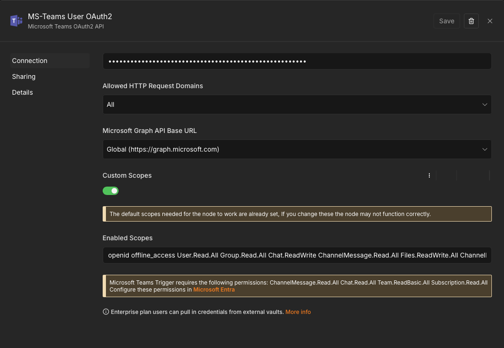
  * Connect your Microsoft account
    

## Workflow

Import workflows [Mattermost-2-Teams.json](./Mattermost-2-Teams.json) and [Teams-2-Mattermost.json](./Teams-2-Mattermost.json) in n8n.

### Constants

Modify the `Set Workflow Constants` node according to your environment.

#### Teams-2-Mattermost

* `Mattermost_URL`, obviously. Format: `https://MISSING_MATTERMOST_DOMAIN/api`
* `My_MsTeams_Name`, your MS-Teams display name
  * Used to filter (self-) messages in the "Only Messages From Others" workflow node
  * Yes! You heard right - your n8n workflow will even be triggered for outgoing messages
* `Mattermost_ChannelID`, the Mattermost channel ID for direct messages between your and the n8n Mattermost "user"

#### Mattermost-2-Teams

* `Mattermost_URL`, obviously. Format: `https://MISSING_MATTERMOST_DOMAIN/api`
* (optional) If your [markdown-2-png converter](../md2png/) isn't reachable under `localhost:3000` for the n8n server, please configure the URL in the "Render Response Message to PNG" node accordingly.

## Mattermost Slash Command (2/2)

Fill the webhook production URL of the "Incoming Message" node of the Mattermost-2-Teams workflow into the previously created slash command's request URL.

## Publish Workflows

Publish both n8n workflows.


# APPENDIX

## Example Message

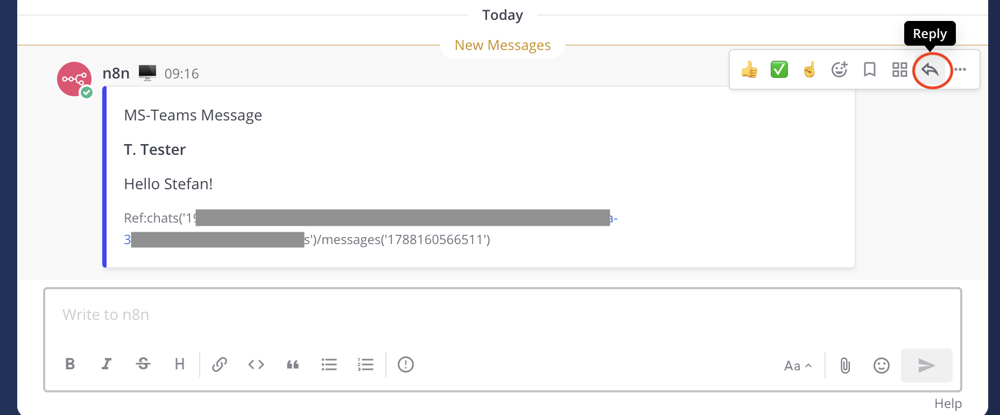
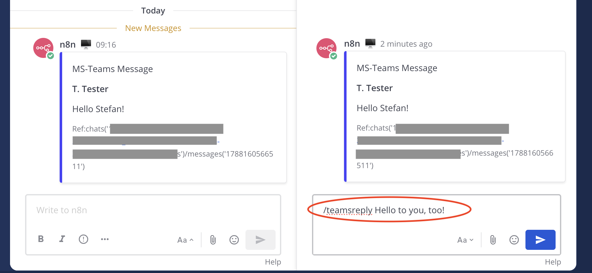
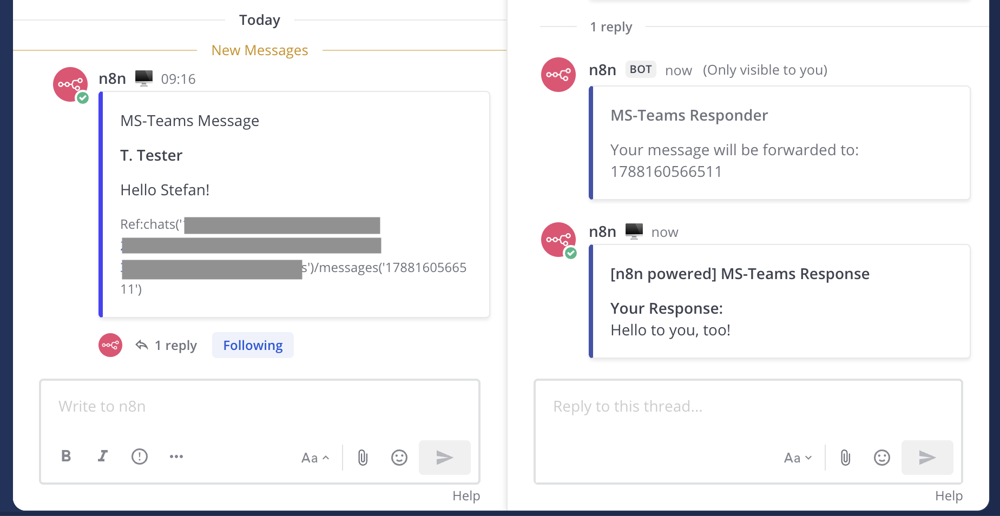
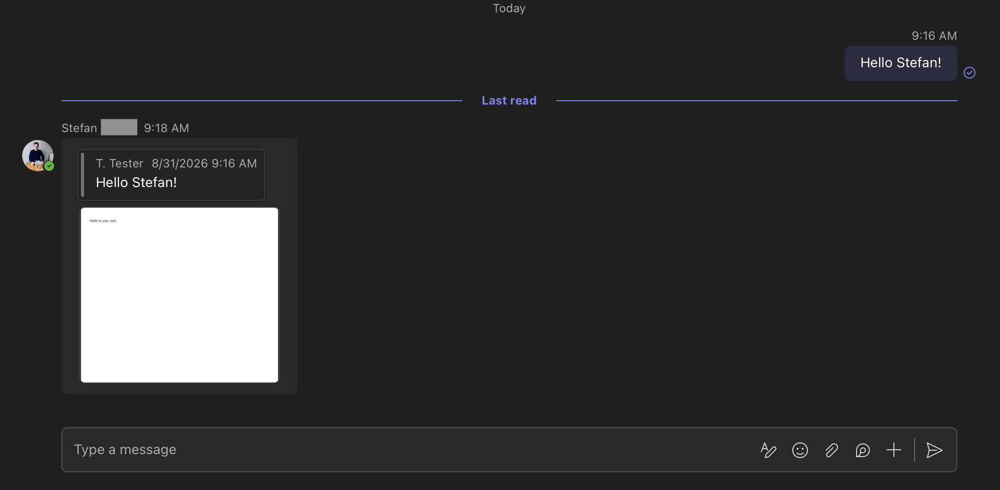
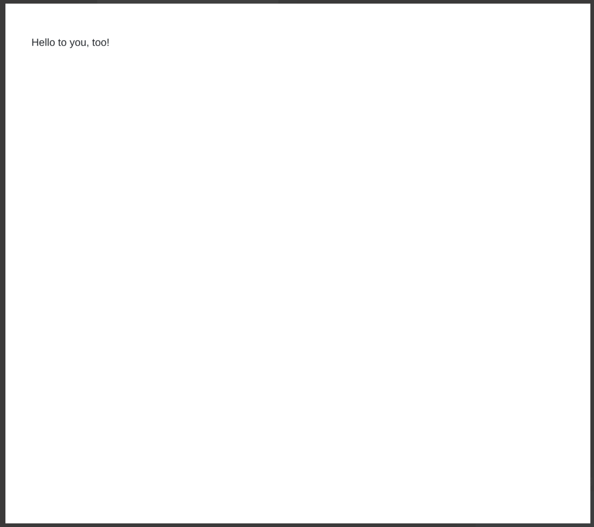

## Example Message With Attached Image

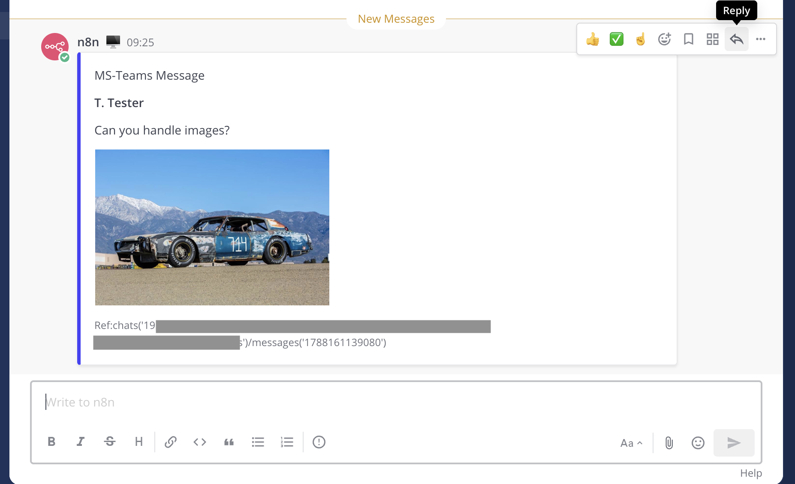
