# Forward MS-Teams Messages To Slack

This tutorial shows how to set up two n8n workflows and credentials that forward MS-Teams messages to Slack.
When receiving an MS-Teams message in Slack, you can reply to the message in a thread.

## Prerequisites

* MS-Azure org admin role (used to create an App registration)
* Slack admin role (create and activate a Slack App)
* Somewhere to host a [markdown-2-png converter](../md2png/), this tutorial runs this as an n8n sidecar (Kubernetes) container
* n8n needs to be able to send HTTP(S) requests to Slack
* Microsoft's servers need to be able to send HTTP(S) requests to your n8n instance (`/webhook` needs to be public)

## Slack App (1/2)

* Create a new [Slack App](https://api.slack.com/apps). This tutorial names the app "n8n"
* (optional) setup basic information and upload an App logo
* Deactivate the socket mode
  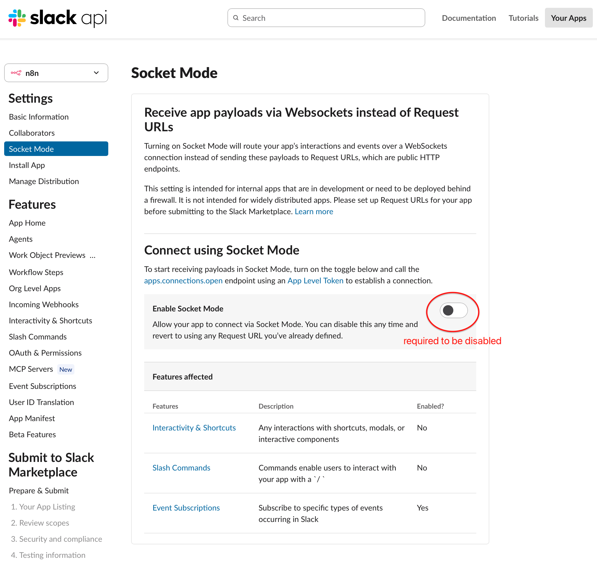
* Enable replying to Bot messages
  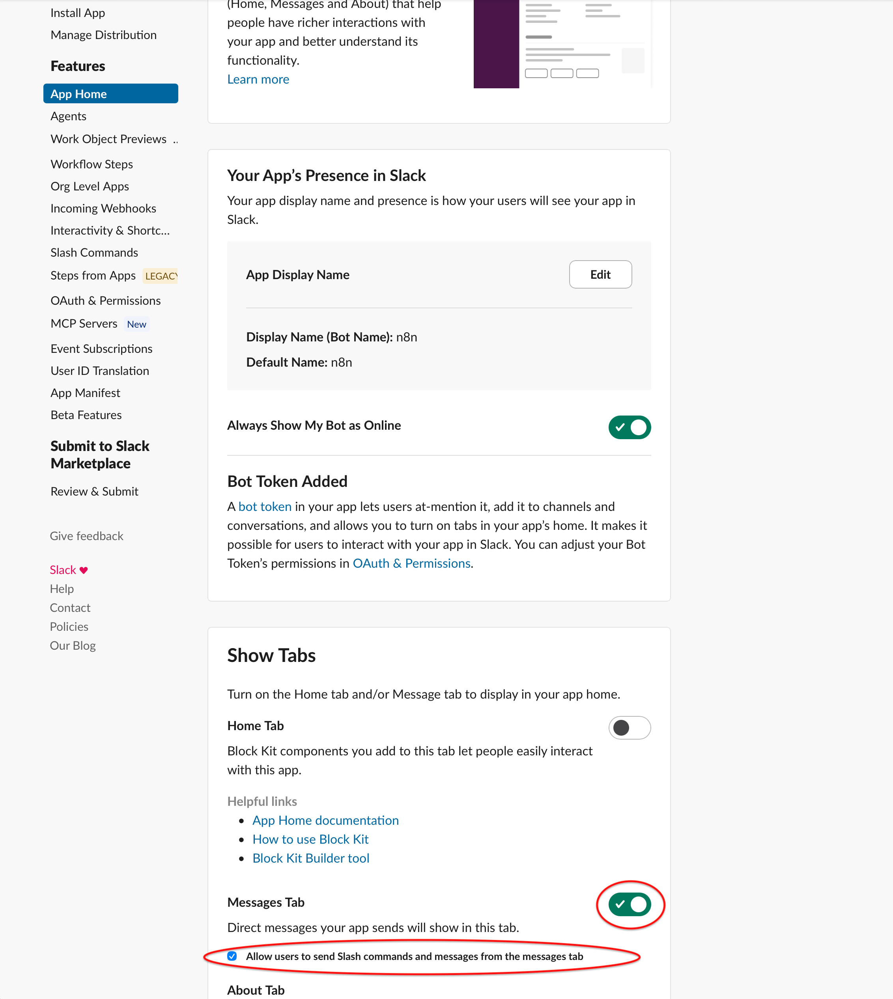
* Setup the following OAuth scopes: `app_mentions:read`, `chat:write`, `chat:write.public`, `files:read`, `files:write`, `im:history`, and `im:write`
  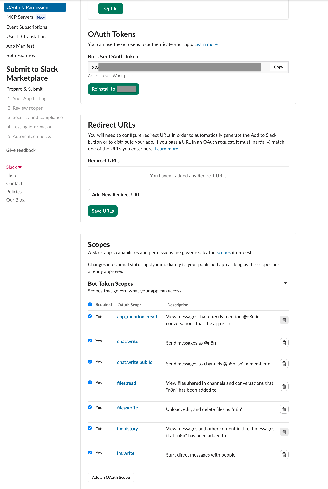
* (Re-)Install the Slack App to your Slack workspace (e.g. under OAuth & Permissions, as above)

## Credentials

* Relace the `MISSING_SLACK_APP_BOT_USER_OAUTH_TOKEN` in [credentials.json](./credentials.json) with the "Bot User OAuth Token", displayed in your Slack App
* Create [Azure App Registration](https://docs.n8n.io/integrations/builtin/credentials/microsoft)
  * Login and navigate to [Azure App registrations](https://portal.azure.com/#view/Microsoft_AAD_RegisteredApps/ApplicationsListBlade) page
    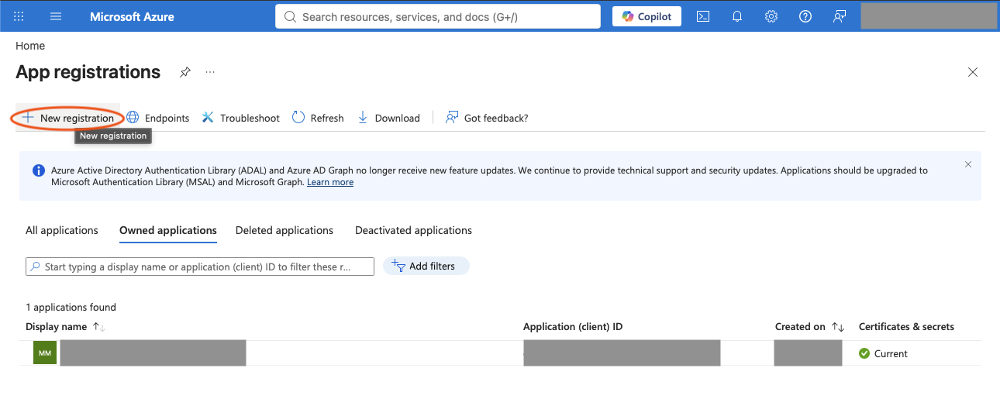
  * Create App Registration with "Any Entra ID Tenant + Personal Microsoft accounts" as supported accont types
    
  * Under "API permissions", add the following Microsoft Graph application permissions:
    * `Channel.ReadBasic.All`
    * `ChannelMessage.Read.All`
    * `OnlineMeetings.ReadWrite`
    * `OnlineMeetings.ReadWrite.All`
    * `Team.ReadBasic.All`
    * `User.Read`
  * Let an org admin consent to these permissions for your organization
    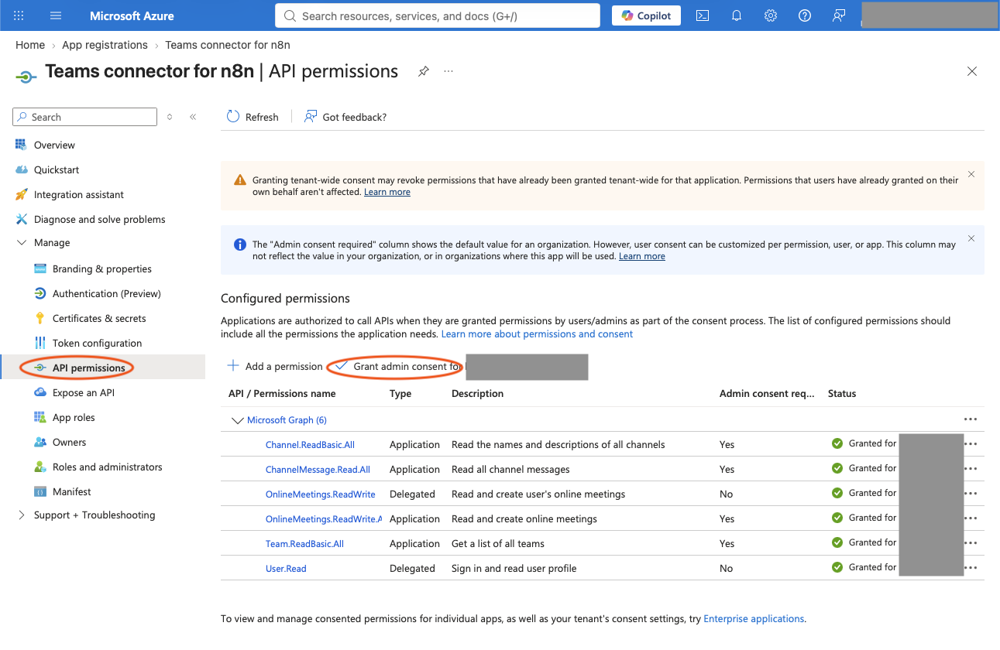
  * Create a client secret under "Certificates and Secrets"
    
* Import credentials in n8n
  ```bash
  n8n import:credentials --input=credentials.json
  ```
  ... or manually create them in the n8n web-ui
* Modify the "Microsoft Teams OAuth2 API" credential in the n8n web-ui
  * Enter the client ID (Azure App Registration "Application (client) ID")
  * Enter client secret (Azure App Registration client secret)
  * Enable "Custom Scopes": **openid offline_access User.Read.All Group.Read.All Chat.ReadWrite ChannelMessage.Read.All Files.ReadWrite.All ChannelMessage.Send**
    
  * Connect your Microsoft account
    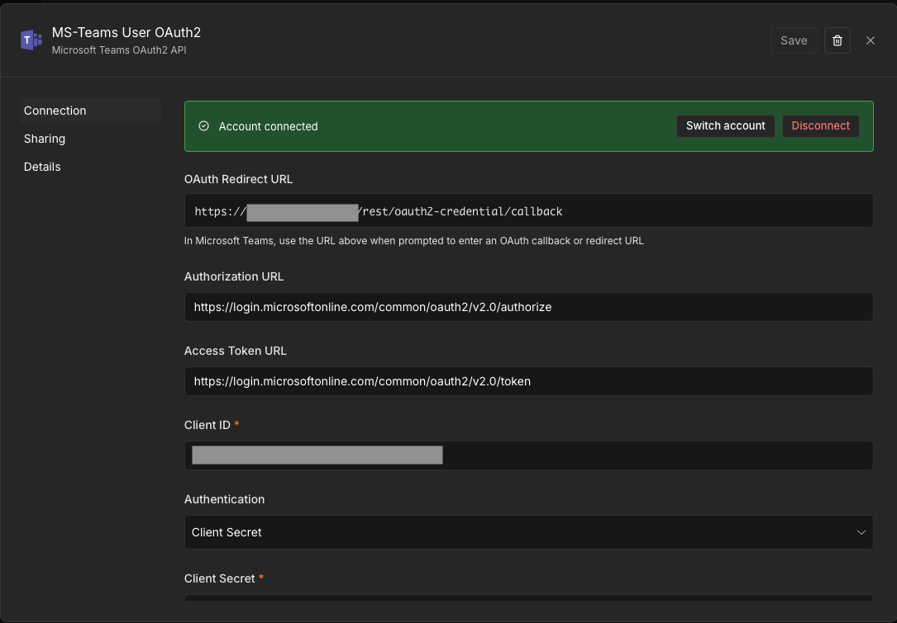

## Workflow

Import workflows [Slack-2-Teams.json](./Slack-2-Teams.json) and [Teams-2-Slack.json](./Teams-2-Slack.json) in n8n.

### Constants

#### Teams-2-Slack

* Modify the `Set Workflow Constants` node according to your environment.
  * `My_MsTeams_Name`, your MS-Teams display name
    * Used to filter (self-) messages in the "Only Messages From Others" workflow node
    * Yes! You heard right - your n8n workflow will even be triggered for outgoing messages
  * `Slack_MemberID`, your Slack User ID
    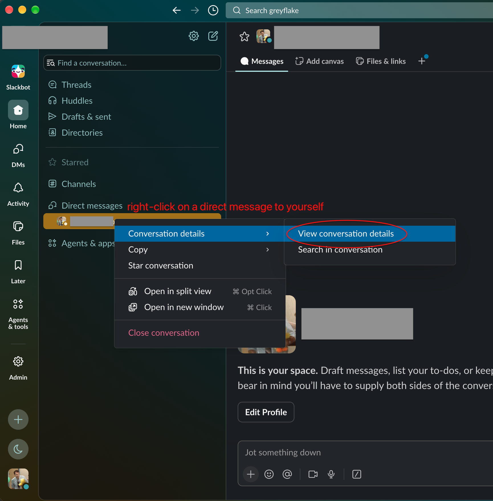
    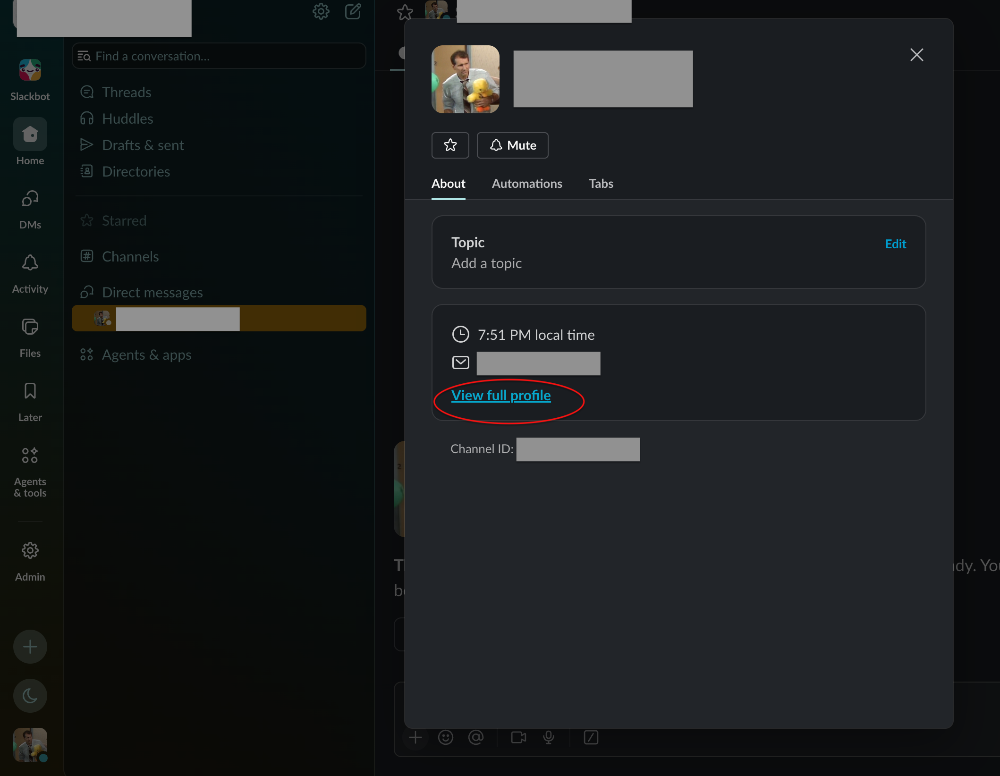
    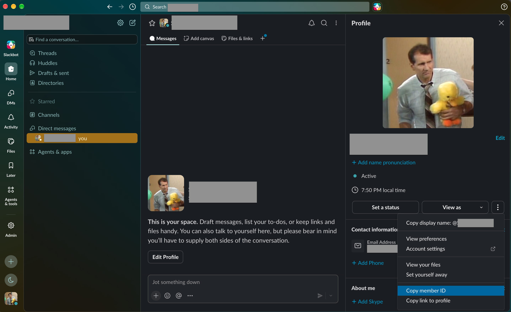

#### Slack-2-Teams

* Modify the `Slack Trigger` node
  * Set your Slack Channel ID to the direct message chat between you and the n8n Bot
    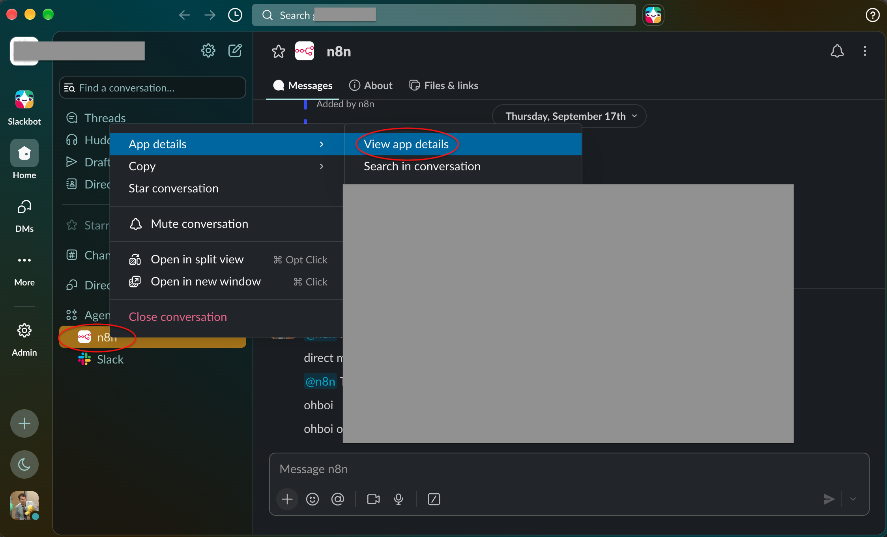
    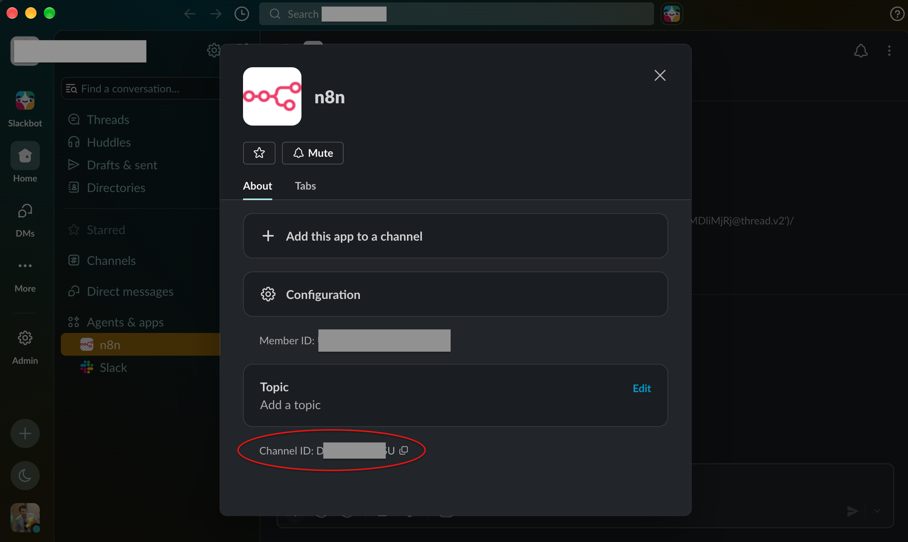
* (optional) If your [markdown-2-png converter](../md2png/) isn't reachable under `localhost:3000` for the n8n server, please configure the URL in the "Render Response Message to PNG" node accordingly.

## Slack App (2/2)

* Fill the webhook production URL of the "Slack Trigger" node of the Slack-2-Teams workflow into the request URL
  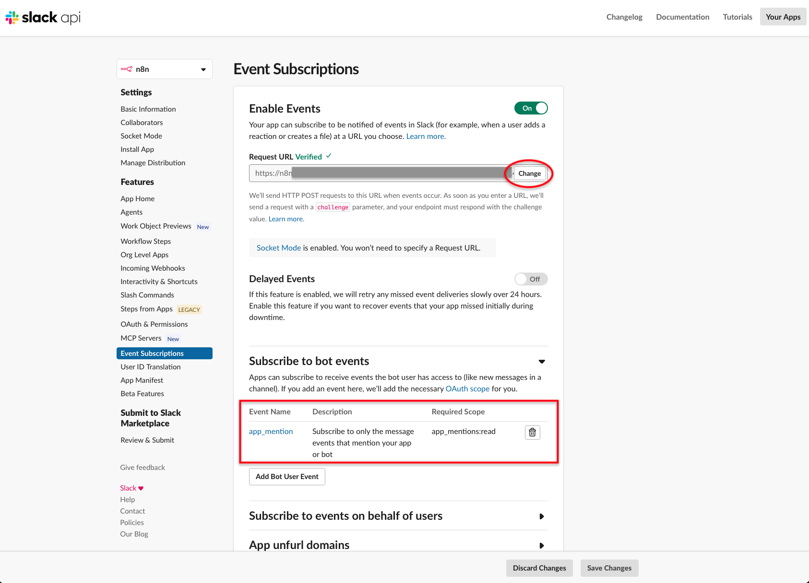
* Reinstall the Slack App to your Slack workspace (e.g. under OAuth & Permissions, as above)

## Publish Workflows

Publish both n8n workflows.


# APPENDIX

## Example Message


